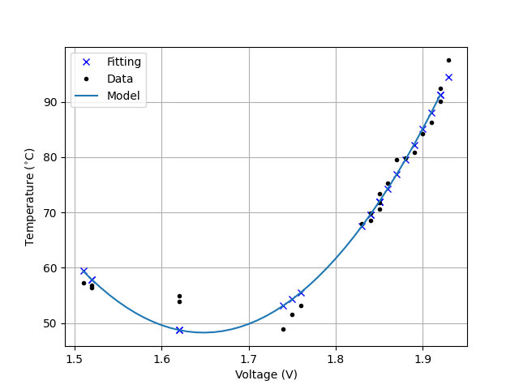

# PT-100 Resistor Temperature Sensor Report
### Authors
- S. Surya Sri: EE25BTECH11053
- Vivaan Parashar: AI25BTECH11040


## Aim
To study and implement a PT100 Resistance Temperature Detector (RTD) system using an Arduino Uno, measure temperature variations and model the voltage-temperature relationship using the least square method (linear regression) for calibration and validation.

## Components Required
1. PT100 RTD Sensor
2. Arduino Uno and USB Cable
3. Breadboard
4. Jumper Wires
5. Resistors (2)
6. Controlled heat sources

## Theory
The PT100 RTD sensor operates on the principle that the resistance of platinum changes predictably with temperature. The resistance at 0°C is 100 ohms, and it increases approximately linearly with temperature, or quadratically (Callendar-Van Dusen equation). The relationship can be expressed as:
$$T(V) = a + bV + cV^2$$
where $T(V)$ is the temperature in °C, $V$ is the voltage across the PT100 sensor, and $a$, $b$, and $c$ are coefficients determined through calibration.

## Circuit description
The PT100 sensor is connected in a voltage divider configuration with a known resistor. The voltage across the PT100 is measured using the Arduino's analog input. The circuit diagram is as follows:

```          +5V
           |
          [R1]  (Known Resistor)
           |
           +-----> A0 (Arduino Analog Input)
           |
         [PT100]
           |
          GND
```

## Codes
### Training data (Python)
```python
import numpy as np
import matplotlib.pyplot as plt

A = np.loadtxt('./training.csv', delimiter=',')
A = A[A[:,1].argsort()]
X = np.hstack((np.ones((A.shape[0],1)),A[:,[1]],A[:,[1]]**2))
T = A[:,[0]]
C = A[:,[1]]

#Least squares method
a, b, c = map(lambda x: x[0], np.linalg.lstsq(X, T, rcond=None)[0])
lsq = np.array([
    [a],
    [b],
    [c]
])
print(f"Coefficients: {a}, {b}, {c}")

min_v = np.min(C)
max_v = np.max(C)

rng = np.arange(min_v, max_v, step=0.01).reshape(-1, 1)

#Plot both the results
plt.plot(C, X@lsq, 'bx', label='Fitting')
plt.plot(C, T, 'k.', label='Data')
plt.plot(rng, np.hstack((np.ones((rng.shape[0],1)), rng, rng**2))@lsq)
plt.legend()
plt.grid()
plt.xlabel('Voltage (V)')
plt.ylabel('Temperature ($^{\\circ}$C)')
plt.savefig('../../figs/training.png')

#Close current figure(s)
plt.close('all')

# Plot for validation
B = np.loadtxt('validation.csv', delimiter=',')
B = B[B[:,1].argsort()]
Xv = np.hstack((np.ones((B.shape[0],1)),B[:,[1]],B[:,[1]]**2))
Cv = B[:,[1]]
Tv = B[:,[0]]
plt.plot(Cv, Xv@lsq, 'rx', label="predictions")
plt.plot(Cv, Tv, 'k.', label="actual data")
plt.xlabel('Output Voltage (V)')
plt.ylabel('Temperature ($^{\\circ}$C)')
plt.legend()
plt.grid()
plt.savefig('../../figs/validation.png')
```

### Arduino code (Reading voltages)
```c
#include <LiquidCrystal.h>
#include <math.h>

const int rs = 12, en = 11, d4 = 5, d5 = 4, d6 = 3, d7 = 2;
LiquidCrystal lcd(rs, en, d4, d5, d6, d7);

void setup() {
  // set up the LCD's number of columns and rows:
  lcd.begin(16, 2);
  // Print a message to the LCD.
}

void loop() {
  int a = analogRead(A0);
  float voltage = a * (5.0 / 1023.0);

  lcd.setCursor(0, 0); // Move to the first line
  lcd.print("Voltage: ");
  lcd.print(voltage);
  lcd.print("V");
}
```

### Arduino code (Showing temperatures)
```c
#include <LiquidCrystal.h>
#include <math.h>

const int rs = 12, en = 11, d4 = 5, d5 = 4, d6 = 3, d7 = 2;
LiquidCrystal lcd(rs, en, d4, d5, d6, d7);

void setup() {
  // set up the LCD's number of columns and rows:
  lcd.begin(16, 2);
  // Print a message to the LCD.
  lcd.setCursor(0, 0); // Move to the first line
  lcd.print("Temperature:");
  // Serial.begin(9600);
}

void loop() {
  int r = analogRead(A0);
  float voltage = r * (5.0 / 1023.0);
  double a = 1628.651682076511, b = -1917.5811024129323, c = 581.6804791446455, d = 1, e = 1, f = 1; // Coefficients for calibration curve
  double temperature = a + b*voltage + c*pow(voltage, 2);// + d*pow(voltage, 3) + e*pow(voltage, 4) + f*pow(voltage, 5); // Convert voltage to temperature
  lcd.setCursor(0, 1); // Move to the second line
  lcd.print(temperature);
  lcd.print((char)223); // Degree symbol
  lcd.print("C");
}
```

## Results
### Training graph

### Validation graph

