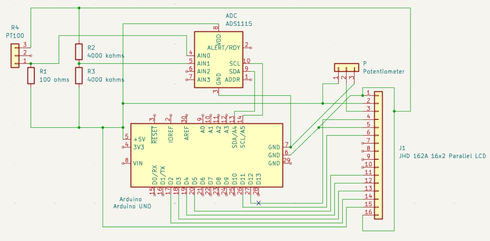
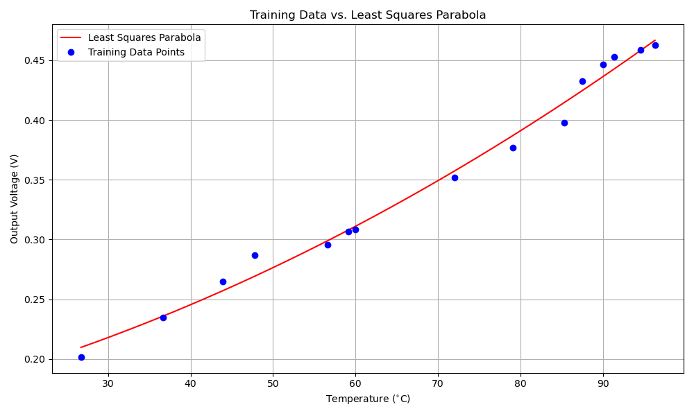
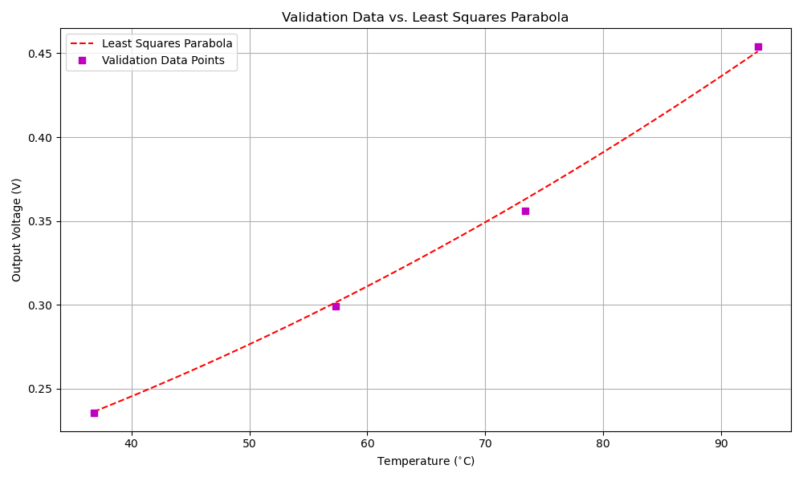

# PT100 Temperature Sensor with Arduino
The idea of this project is to build an accurate digital thermometer using a PT100 RTD (Resistance Temperature Detector). A high-precision ADS1115 ADC is employed along with an Arduino to accurately read the voltage and compute the temperature. The final temperature is displayed on a 16x2 LCD screen.

## Hardware
* PT-100 RTD Sensor
* Arduino Uno
* ADS1115 16-bit ADC
* 100 ohms Precision Resistor
* Two 4 kilo ohms Resistors
* JHD 162A (16x2) Parallel LCD
* 22 kilo ohms Potentiometer
* Breadboard & Jumper Wires

## Circuit
The circuit uses a wheatstone bridge (100 ohms resistor and PT100 along with two 4 kilo ohms resistors). The ADS1115 measures the voltage across the two terminals, so that the Arduino can compute the temperature.

## Software
The project runs on the Arduino (`codes/arduino/code/code.ino`). The following library must be included:
* `Adafruit ADS1X15`

## Least Squares Implementation
The sensor is calibrated using a quadratic equation (`V = aT^2 + bT + c`) because the PT100's response is not perfectly linear.
* `codes/linear_regression/lsq.py` is the Python script used to find the equation's coefficients.
* `tables/training_data.txt` contains the data used to train the model.
* `tables/validation_data.txt` contains separate data used to test the model's accuracy.

The Arduino code uses the coefficients from this script to convert the measured voltage into an accurate temperature.

### Training & Validation Plots

